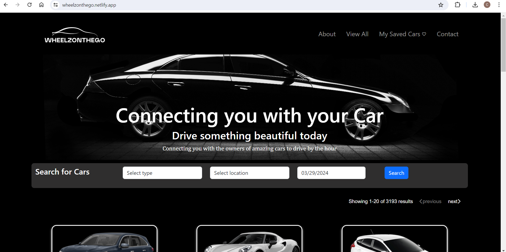

# WheelzOnTheGo

A Car Sharing App

      <h1>  WheelzOnTheGo</h1>
     

# Description

WheelzOnTheGo is a car sharing platform designed to provide exceptional car rental services catering to a wide range of needs, preferences, and destinations. Similar to Airbnb for cars, users can rent cars by the hour, with rates varying based on the car category. The platform utilizes a JSON file to populate available car details, offering a clean UI to browse cars in the user's area.

# Features

Browse a variety of cars available in your city and rent them by the hour.
Clean and intuitive user interface for easy navigation.
Click on cars to view specifications and even hear engine noises (optional).

## Instalation

No installation required. The Web page can be viewed using modern web browser such as Microsoft Edge, Firefox, chrome amongst other browser.

## ScreenShot

The following images shows the web application's appearance and functionality:

## Libraries Integration

Bootsrap: Boostrap is used

JSON file Library package

## Contributing

Contributions are welcome! Don't hesitate to chip in your ideas, file bug report or provide suggestion on improvement. Kindly open an issue or submit a pull request.

## License

This project is licensed under the [MIT License](LICENSE).

## Credit

This project has been collaboratively made by:

[mandyjmiller](https://github.com/mandyjmiller)

[esther-adeola](https://github.com/esther-adeola)

[HarunaTech](https://github.com/HarunaTech)

[Costea47](https://github.com/Costea47)

[Ifeoma101](https://github.com/ifeoma101)

## Live site Access

Please click to see the deployed live site [WheelzOnTheGo](https://wheelzonthego.netlify.app/)
